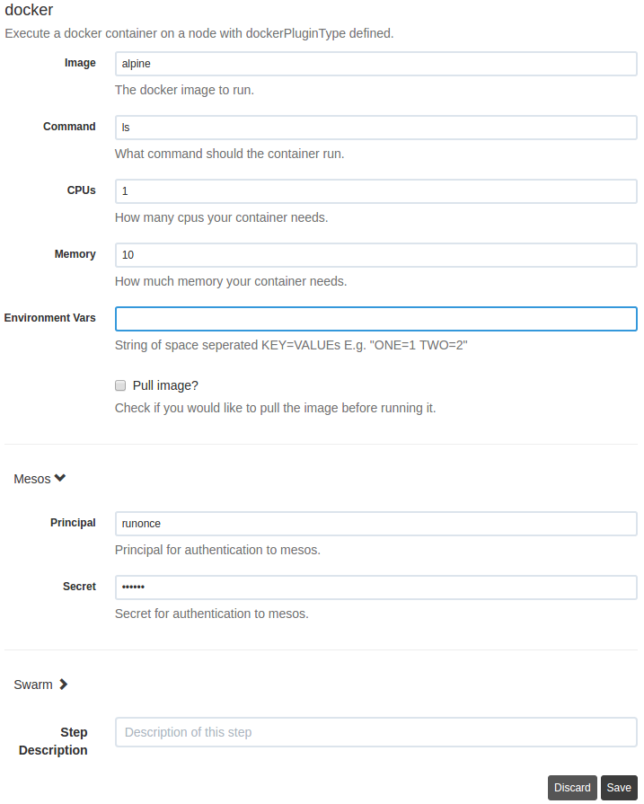

# rundeck-docker-plugin
Rundeck interface for running docker containers against nodes. Nodes need to
have an attribute of `dockerPluginType` defined which is a String of either
`mesos`, `swarm`, or `docker`. Users may then configure this plugin's form
elements to run their container on any / all of the selected nodes that have a
`dockerPluginType` defined. It is also expected that the node have a `port`
defined as well.

Mesos is currently the only one that is supported.

# Usage
To get this working you will need:

- A rundeck server
- [mesos-runonce](https://github.com/yp-engineering/mesos-runonce) available in
  the rundeck server's $PATH
- This plugin's .zip file either from the
  [releases](https://github.com/yp-engineering/rundeck-docker-plugin/releases)
  (Coming soon), or by cloning and running `make`.
- Installing this plugin's .zip file into the rundeck server's plugin path
  (usually $RDECK_BASE/libext).
